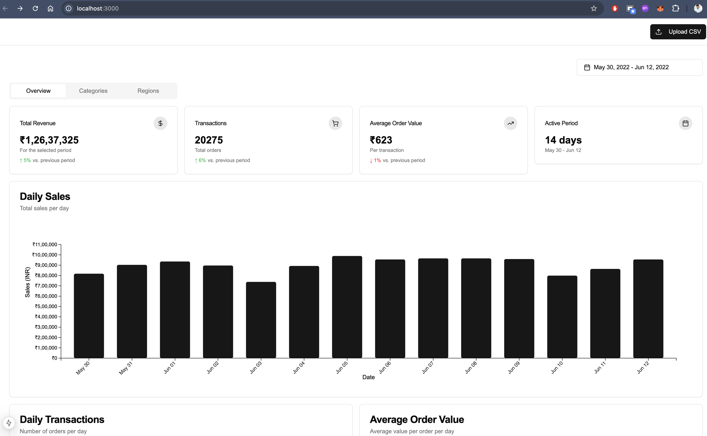

# Sales Report

A dynamic and interactive data visualization dashboard for e-commerce sales analysis.



## Tech Stack

- **Framework**: Next.js (React)
- **Styling**: Tailwind CSS with shadcn/ui components
- **Visualizations**: D3.js
- **Animations**: Framer Motion

## Getting Started

### Prerequisites

- Node.js 20.x or higher
- npm or pnpm or bun

### Installation

1. . Install dependencies:
```bash
npm install
# or
yarn install
```

3. Run the development server:
```bash
npm run dev
# or
yarn dev
```

4. Open [http://localhost:3000](http://localhost:3000) with your browser to see the application.

## Usage

### Uploading Data

1. Click on the "Upload" button in the dashboard header
2. Select a CSV file containing your sales data
3. The dashboard will automatically update with your data

### Filtering Data

- Use the date range picker to select a specific time period
- Click on segments in the pie charts to filter by category or region
- Click "Reset Filters" to clear all filters

### Analyzing Data

The dashboard provides various visualizations:
- Daily sales chart
- Daily transactions chart
- Average order value trends
- Category distribution
- Regional distribution

## CSV Format

For best results, your CSV file should include the following columns:
- Order ID
- Date
- Status
- Quantity
- Amount
- Currency
- Category
- City
- State/Region

## Acknowledgments

- [D3.js](https://d3js.org/) for powerful data visualizations
- [shadcn/ui](https://ui.shadcn.com/) for the beautiful UI components
- [Tailwind CSS](https://tailwindcss.com/) for the utility-first CSS framework
- [Framer Motion](https://www.framer.com/motion/) for smooth animations